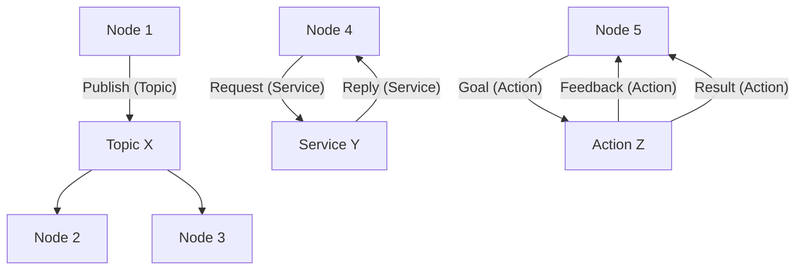

---
title: "ROS 2 Communication: Nodes, Topics, Services, and Actions"
slug: /module-1/nodes-topics-services
sidebar_position: 3
---

# ROS 2 Communication: Nodes, Topics, Services, and Actions

## The Pillars of ROS 2 Communication

Effective communication is at the heart of any distributed robotic system. ROS 2 provides a robust set of communication mechanisms, each suited for different interaction patterns. These include nodes, topics, services, and actions. Understanding these elements is crucial for designing and implementing complex robot behaviors (D. H. Kim et al., 2021).

## Nodes and their Roles

As introduced in ROS 2 Basics, **nodes** are individual computational units. Each node encapsulates a specific functionality, promoting modularity and reusability. For instance, a robot might have separate nodes for:

*   **Sensor Drivers**: Nodes that interface directly with hardware sensors (e.g., camera, LiDAR) and publish their data into the ROS 2 ecosystem.
*   **Actuator Controllers**: Nodes responsible for sending commands to motors, grippers, or other actuators based on received instructions.
*   **High-Level Algorithms**: Nodes that implement complex logic such as path planning, object recognition, or decision-making.

By dividing functionality into nodes, developers can test, debug, and upgrade individual components without affecting the entire robot system.

## Asynchronous Communication: Topics

**Topics** are the most common form of communication in ROS 2, enabling asynchronous, many-to-many data streaming. They operate on a publish/subscribe model:

*   **Publishers**: Nodes that send messages to a specific topic. They don't know or care which (if any) other nodes are listening.
*   **Subscribers**: Nodes that receive messages from a specific topic. They listen for messages and process them as they arrive.

This decoupled communication is ideal for continuous data streams like sensor readings (e.g., camera images, odometry) or motor commands. ROS 2 ensures efficient and reliable data transfer through its underlying DDS implementation (Open Robotics, 2023).

### Example: Simple ROS 2 Publisher (Pseudo-code)

This Python pseudo-code illustrates a node publishing string messages to a topic.

```python
# filename: simple_publisher.py
import rclpy
from std_msgs.msg import String

def main(args=None):
    rclpy.init(args=args)
    node = rclpy.create_node('my_publisher_node')
    publisher = node.create_publisher(String, 'chat_topic', 10) # Topic name: 'chat_topic'

    msg = String()
    count = 0
    while rclpy.ok():
        msg.data = f'Hello from publisher! Count: {count}'
        node.get_logger().info(f'Publishing: "{msg.data}'')
        publisher.publish(msg)
        count += 1
        rclpy.spin_once(node, timeout_sec=1.0) # Publish every 1 second

    node.destroy_node()
    rclpy.shutdown()

if __name__ == '__main__':
    main()
```

### Example: Simple ROS 2 Subscriber (Pseudo-code)

This pseudo-code shows a node subscribing to the same topic and processing incoming messages.

```python
# filename: simple_subscriber.py
import rclpy
from std_msgs.msg import String

def topic_callback(msg):
    rclpy.get_logger('my_subscriber_node').info(f'I heard: "{msg.data}'')

def main(args=None):
    rclpy.init(args=args)
    node = rclpy.create_node('my_subscriber_node')
    subscriber = node.create_subscription(String, 'chat_topic', topic_callback, 10)
    # Prevent unused variable warning
    subscriber

    node.get_logger().info('Subscriber node started, waiting for messages...')

    try:
        rclpy.spin(node)
    except KeyboardInterrupt:
        node.get_logger().info('Subscriber node stopped cleanly.')
    finally:
        node.destroy_node()
        rclpy.shutdown()

if __name__ == '__main__':
    main()
```

## Synchronous Communication: Services

**Services** provide a synchronous request/reply communication pattern. This is suitable for tasks where a client needs an immediate response from a server. For example, a client node might request a robot to perform a specific action (e.g., "rotate 90 degrees") and wait for confirmation that the action is complete (Open Robotics, 2023).

*   **Service Servers**: Nodes that implement a specific service. They wait for incoming requests, process them, and send back a response.
*   **Service Clients**: Nodes that send requests to a service server and block (wait) until a response is received.

## Goal-Oriented Communication: Actions

**Actions** are designed for long-running, goal-oriented tasks that require periodic feedback and can be preempted. They are built on top of topics and services and are ideal for tasks like navigating to a goal, manipulating an object, or performing a complex sequence of motions (Macenski et al., 2022).

An action interaction involves:

*   **Goal**: The desired outcome (e.g., `navigate to [x, y]`).
*   **Feedback**: Continuous updates on the progress towards the goal (e.g., `current position: [x_current, y_current]`).
*   **Result**: The final outcome upon completion (e.g., `goal reached successfully`).

Actions are more robust than services for long tasks because they allow the client to monitor progress and cancel the goal if needed.

## Communication Summary Diagram

This diagram visualizes the different ROS 2 communication patterns.




## References

```yaml
references:
  - author: "D. H. Kim, J. K. Park, & S. J. Lee"
    year: 2021
    title: "ROS 2 in Action: Build Your Own ROS 2 Projects"
    publisher: "Manning Publications"
  - author: "Open Robotics"
    year: 2023
    title: "ROS 2 Documentation: Concepts"
    url: "https://docs.ros.org/en/humble/Concepts.html"
  - author: "Macenski, S., Foote, T., Gerkey, B., & Konolige, K."
    year: 2022
    title: "ROS 2: The Robot Operating System for the Modern Era."
    journal: "IEEE Robotics & Automation Magazine, 29"(4), 118-128."
```

