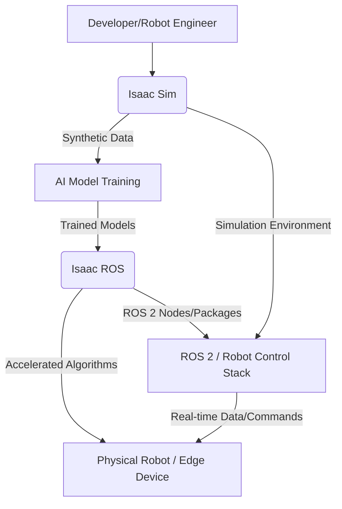

---
title: "NVIDIA Isaac Sim and Isaac ROS: The AI-Robot Brain Platform"
slug: /module-3/isaac-sim-ros-overview
sidebar_position: 2
---

# NVIDIA Isaac Sim and Isaac ROS: The AI-Robot Brain Platform

## Introduction to NVIDIA Isaac Platform

As robots become more autonomous and intelligent, the complexity of their "brains"—the software that enables perception, decision-making, and control—grows exponentially. NVIDIA's Isaac platform is a comprehensive toolkit designed to accelerate the development and deployment of AI-powered robots. It combines high-fidelity simulation, powerful AI frameworks, and hardware acceleration to bridge the gap between virtual prototyping and real-world deployment (NVIDIA, 2024).

The Isaac platform is crucial for modern robotics because it addresses several key challenges:

*   **Data Scarcity**: Training advanced AI models for robots requires vast amounts of diverse data, which is expensive and time-consuming to collect from physical robots.
*   **Complex Environments**: Robots need to operate reliably in dynamic, unstructured environments, demanding sophisticated perception and navigation capabilities.
*   **Sim-to-Real Gap**: Ensuring that AI models trained in simulation perform effectively when transferred to real robots is a significant hurdle.

NVIDIA Isaac tackles these issues through two primary components: **Isaac Sim** for simulation and **Isaac ROS** for accelerated robotics applications.

## NVIDIA Isaac Sim: High-Fidelity Simulation

**Isaac Sim** is a scalable robotics simulation application built on NVIDIA's Omniverse platform. It provides a highly realistic, physically accurate virtual environment where developers can create, test, and manage virtual robots and their operational scenarios. Its key features include:

*   **Photorealistic Rendering**: Leveraging NVIDIA's advanced rendering capabilities, Isaac Sim generates visually stunning and physically accurate scenes, crucial for training perception models.
*   **PhysX Integration**: A robust physics engine ensures realistic dynamics, collisions, and joint movements for robots and objects in the simulation.
*   **Synthetic Data Generation (SDG)**: One of Isaac Sim's most powerful features, SDG allows developers to automatically generate large, diverse datasets (e.g., images with ground truth labels) for training deep learning models. This bypasses the need for manual data collection and annotation (Mahmood et al., 2023).
*   **ROS 2 Integration**: Seamless connectivity with ROS 2 allows developers to use their existing ROS 2 applications and tools within the simulated environment, enabling a smooth transition from development to deployment.

## NVIDIA Isaac ROS: Accelerated Robotics Applications

**Isaac ROS** is a collection of hardware-accelerated ROS 2 packages that enable developers to build high-performance robotics applications. These packages leverage NVIDIA GPUs to significantly speed up computationally intensive tasks, such as:

*   **Perception**: Accelerating tasks like object detection, semantic segmentation, and 3D reconstruction using deep learning models.
*   **SLAM (Simultaneous Localization and Mapping)**: Faster and more accurate mapping of environments while simultaneously tracking the robot's position.
*   **Navigation**: Efficient path planning and obstacle avoidance using optimized algorithms.
*   **AI Inference**: Running trained deep learning models on edge devices (like NVIDIA Jetson) with high throughput and low latency.

By providing optimized building blocks, Isaac ROS reduces development time and allows robots to perform complex AI tasks in real-time on power-efficient hardware (NVIDIA, 2024).

## Isaac Platform Overview Diagram

This diagram illustrates how Isaac Sim and Isaac ROS work together within the broader NVIDIA Isaac ecosystem.




## Conceptual Example: Loading a Robot in Isaac Sim (Pseudo-code)

This pseudo-code demonstrates the high-level steps involved in loading a robot model and connecting it to a ROS 2 bridge within Isaac Sim.

```python
# filename: load_robot_isaac_sim.py (pseudo-code)

def setup_isaac_sim_robot():
    # Initialize Isaac Sim environment
    isaac_sim_env = IsaacSimEnvironment.create()

    # Load a robot description (e.g., URDF or USD file) into the scene
    robot_asset_path = "omniverse://localhost/NVIDIA/Assets/Robot/Humanoid/franka_emika.usd"
    robot_model = isaac_sim_env.load_robot(robot_asset_path)

    # Configure ROS 2 bridge for communication
    ros2_bridge = isaac_sim_env.create_ros2_bridge()

    # Attach ROS 2 nodes/publishers/subscribers to the robot model
    # For example, publish joint states and subscribe to velocity commands
    ros2_bridge.connect_robot_to_ros2(robot_model, topics=["joint_states"], commands=["cmd_vel"])

    isaac_sim_env.run_simulation()

    log_isaac_sim_status("Robot loaded and connected to ROS 2 in Isaac Sim")
```

## References

```yaml
references:
  - author: "NVIDIA"
    year: 2024
    title: "NVIDIA Isaac Platform"
    url: "https://developer.nvidia.com/isaac"
  - author: "NVIDIA"
    year: 2024
    title: "NVIDIA Isaac Sim Documentation"
    url: "https://docs.omniverse.nvidia.com/app_isaacsim/app_isaacsim/overview.html"
  - author: "Mahmood, R., Pavan, S., & Sridharan, S."
    year: 2023
    title: "Synthetic Data Generation for Robotics with NVIDIA Isaac Sim and Omniverse."
    journal: "arXiv preprint arXiv:2307.03666."
```
